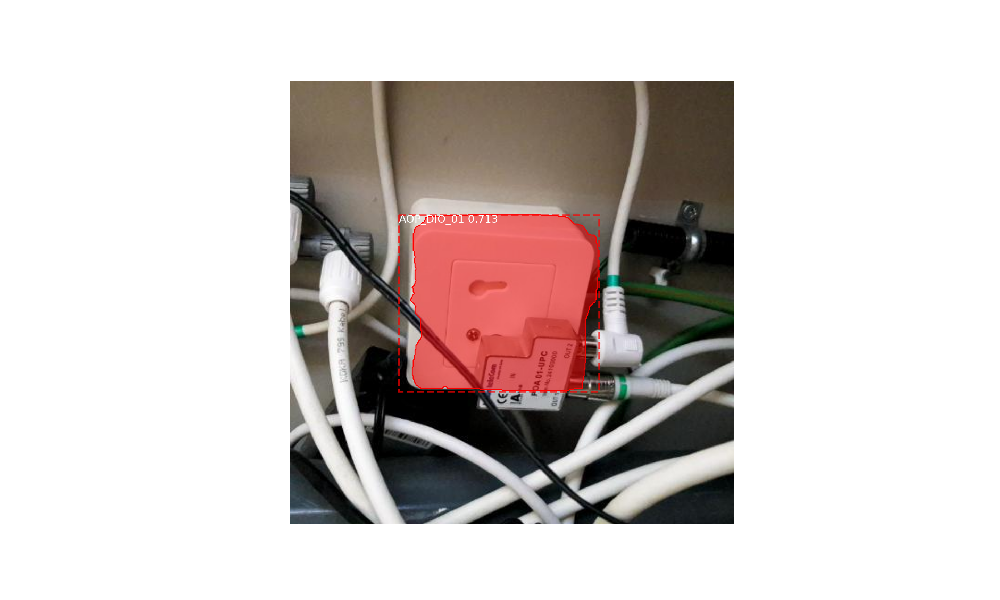

## Mask R-CNN for Object Detection and Segmentation

This model uses Mask RCNN to predict sockets with the following classes:
```python
CLASS_NAMES = [
'BG','AOP_BTV1','AOP_DIO_01','AOP_EVK80''AOP_TRAS1000','AOP_TRAS1000_no_key','AOP_X10DER_KT_01', 'SPLITTER_MCP_03','SPLITTER_POA_01IEC','SPLITTER_POA_01_met_kapje',
'SPLITTER_POA_01_zonder_kapje', 'SPLITTER_POA_3_met_kapje',
'SPLITTER_POA_3_zonder_kapje', 'SPLITTER_SQ601_met_kapje',
'SPLITTER_UMU_met_kapje', 'WCD_tweegats']
```
The model uses the ***mask_rcnn_socketconfig_0001.h5*** weights. 

By reading an image from the **SocketDataset** which is annotated as *'00001.jpeg, 00002.jpeg, 0000x.jpeg'* using **cv2**, you can predict sockets using the following lines:

```python

r = model.detect([image], verbose=0)
r = r[0]

mrcnn.visualize.display_instances(image=image, 
                                  boxes=r['rois'], 
                                  masks=r['masks'], 
                                  class_ids=r['class_ids'], 
                                  class_names=CLASS_NAMES, 
                                  scores=r['scores'])
```

An example of an output is: 



The model predicted the socket as **AOP_DIO_01** with a confidence scores of **0.713**